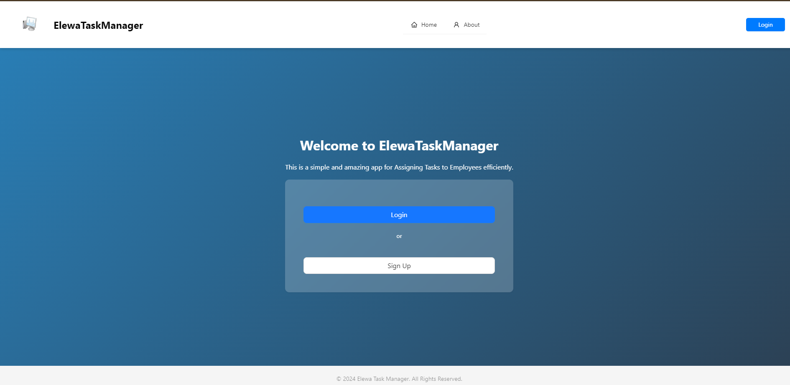
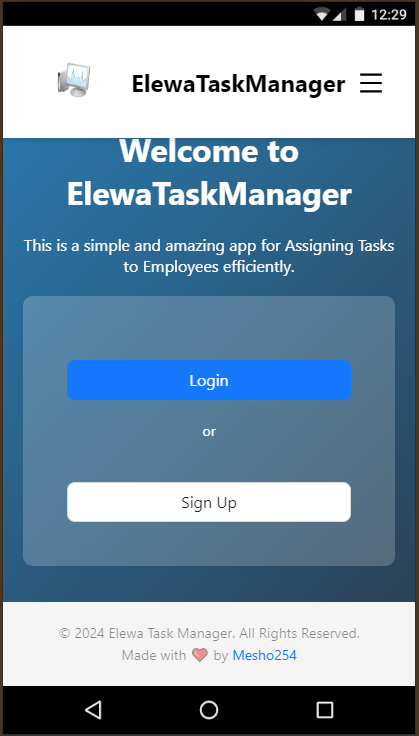
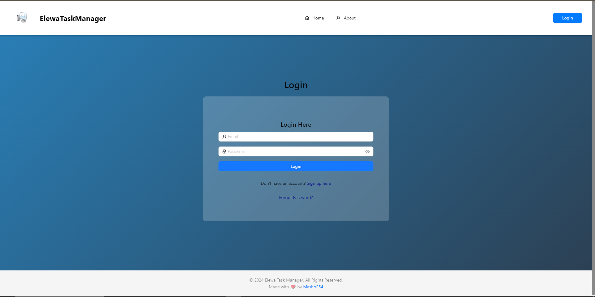
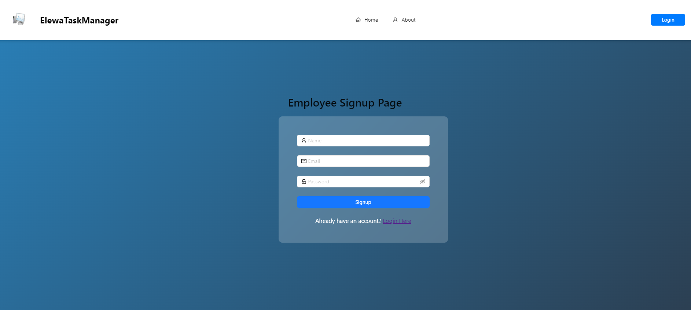
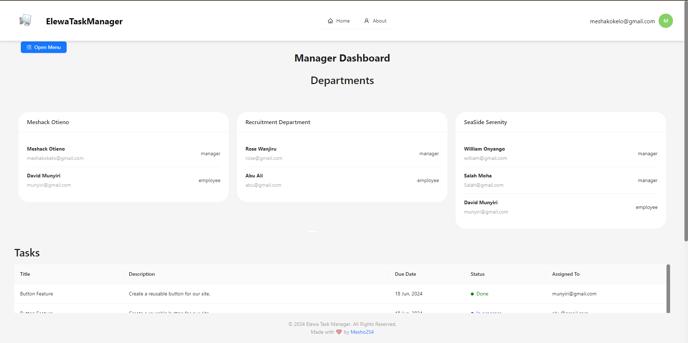
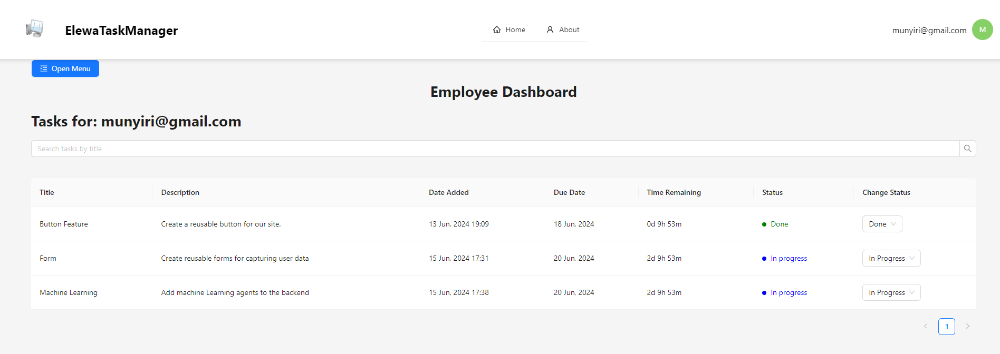
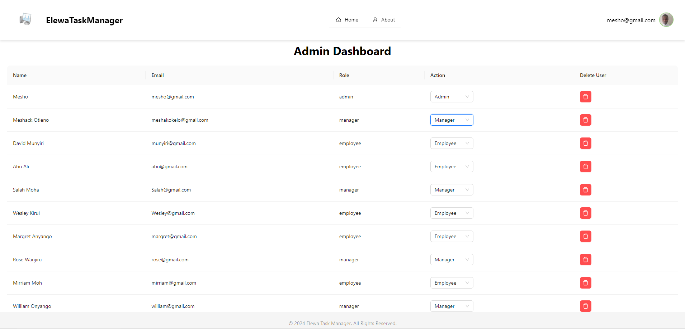
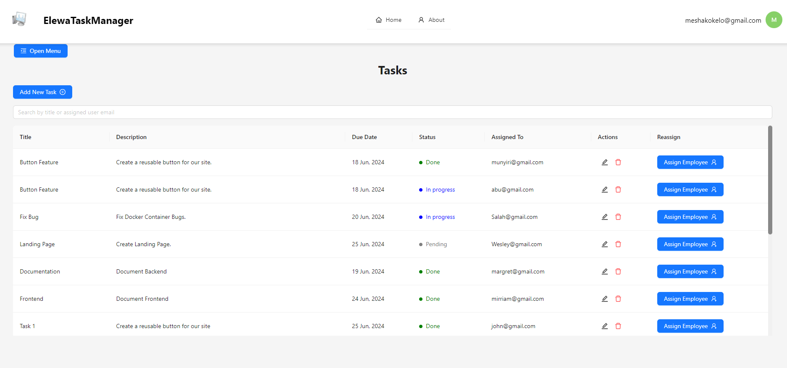
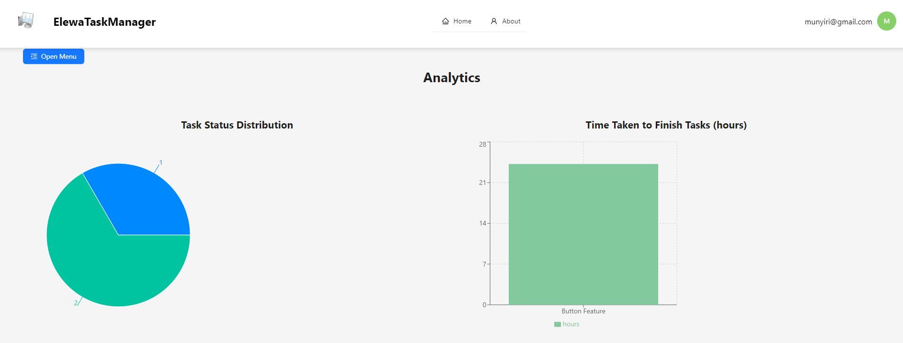

 ### Project Title: Employee Task Management System
 # Overview
- The Employee Task Management System is a MERN (MongoDB, Express.js, React.js, Node.js) stack application designed to streamline task management within an organization. The application allows system administrators, managers, and employees to manage tasks and departments efficiently.

    ### Features:
  ## Landing Page: 
  - Company employees can view the application’s landing page with details about the company and sign-up/log-in buttons.
   
   
  ## Role-Based Access: (Admin Dashboard)
  - Different functionalities are available based on user roles (Admin, Manager, Employee).
   
   - Persistence: All changes persist on reload.
 - User Authentication: Users remain signed in after a refresh.
    # Login
    
    # SignUp
     

 ## Manager Functionalities:
 

Setup and Installation
Prerequisites
Node.js
MongoDB
npm or yarn
Installation
Clone the repository:

sh
Copy code
git clone https://github.com/mesho254/TaskManagerElewa.git
cd taskManagerElewa
Install dependencies for both frontend and Backend:

sh
Copy code
cd frontend
npm install
cd Backend
npm install
Environment Variables:
Create a .env file in the server directory and add the following variables:

env
Copy code
MONGO_URI=mongodb://localhost:27017/your-database-name
JWT_SECRET=your_jwt_secret
PORT=5000
Start the Application:

Server:
sh
Copy code
cd server
npm start
Client:
sh
Copy code
cd client
npm start
Note:
Make sure MongoDB is running locally or provide a connection string to a remote MongoDB instance.

Usage
Admin
Role Assignment: Assign manager roles to users.
URL: /admin-dashboard
Manager
Department Management: Create departments and add employees.
Task Management: Create, edit, assign, and delete tasks.
Employee Management: Move employees between departments and remove employees.
URL: /manager-dashboard
Employee
Task Viewing: View and update task statuses.
URL: /employee-dashboard
Screenshots
Manager Dashboard

Employee Dashboard

Admin Dashboard

Tasks

Analytics

Login Details
Admin
Username: john@gmail.com
Password: 12345678
Manager
Username: jane@gmail.com
Password: 12345678
Employee
Username: racheal@gmail.com
Password: 12345678

sh
Copy code
https://jsonplaceholder.typicode.com
Deployment
The project is hosted Vercel.

Contact
For any issues or feature requests, please contact [meshakotieno343@gmail.com].